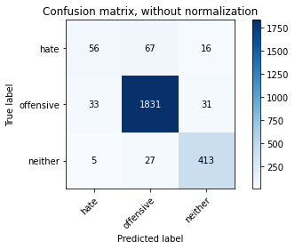
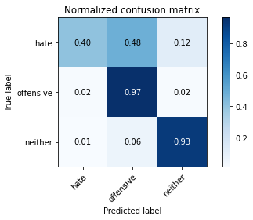
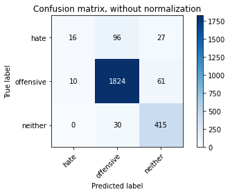
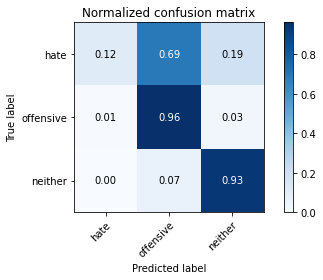
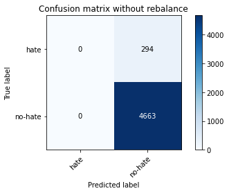
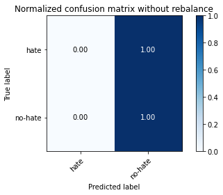
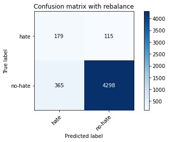
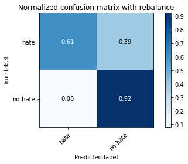

# Results for hate-speech-classification

## DistilBERT
pretrained DistilBERT model trained for 5 epochs

    
                 precision    recall  f1-score   support
        hate        0.53      0.22      0.31       139	
    offensive       0.93      0.97      0.95      1895
      neither       0.88      0.91      0.90       445

    accuracy                            0.92      2479	
    macro avg       0.78      0.70      0.72      2479
    weighted avg    0.90      0.92      0.91      2479

## LSTM
LSTM model trained for 10 epochs

                 precision    recall  f1-score   support
        hate        0.62      0.12      0.19       139
    offensive       0.94      0.96      0.95      1895
     neither        0.83      0.93      0.88       445

    accuracy                            0.91      2479
    macro avg       0.79      0.67      0.67      2479
    weighted avg    0.90      0.91      0.89      2479

## merged class "offensive" and "neither" to "no-hate"

without rebalancing training data (only 6% hate speech)

                    precision    recall  f1-score   support

           hate       0.00      0.00      0.00       294
        no-hate       0.94      1.00      0.97      4663

        accuracy                           0.94      4957
       macro avg       0.47      0.50      0.48      4957
    weighted avg       0.88      0.94      0.91      4957
    
rebalanced the training data with 50:50

                    precision    recall  f1-score   support

            hate       0.33      0.61      0.43       294
         no-hate       0.97      0.92      0.95      4663

        accuracy                           0.90      4957
       macro avg       0.65      0.77      0.69      4957
    weighted avg       0.94      0.90      0.92      4957

